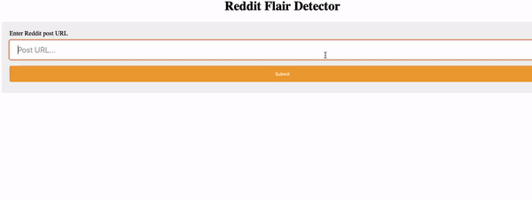

# Reddit-Flair-Detection

Detection of Reddit Post's flairs using machine learning algorithms [[WebPage.](https://reddit-post-flair-detection.herokuapp.com/)]

  </img>

## About
This repo illustrates the task of data acquisition of reddit posts from the [[r/india](https://www.reddit.com/r/india/)] subreddit, performing Exploratory data analysis (EDA) on the acquired data, classification of the posts into 9 different flairs and deploying the best model as a web service.

## Dataset
The data is scrapped by using Reddit's official API [[PRAW](https://praw.readthedocs.io/en/latest/)]. This can be found in  [[Reddit Data Collection.ipynb.]
For further information on how to scrap data refer [[this site.](https://www.storybench.org/how-to-scrape-reddit-with-python/)]

## Installation & Setup
All the required libraries can be found at [[requirements.txt](https://github.com/keshav-b/Reddit-Flair-Detection/blob/master/requirements.txt)]. Create an environment in conda, and install these dependencies by:
`conda install --file requirements.txt`

## Flair Classes
We are considering 9 flairs. The number of samples per class is: (_The reason for choosing 9 flairs can be found_ [Reddit Data Collection.ipynb.]

| Label | Flair              | Samples | 
| ---   | ---                | ---     | 
| 1.    | Coronavirus        | 241     | 
| 2.    | Politics           | 241     | 
| 3.    | Sports             | 227     | 
| 4.    | AskIndia           | 226     | 
| 5.    | Photography        | 221     | 
| 6.    | Science/Technology | 220     | 
| 7.    | Business/Finance   | 217     | 
| 8.    | Non-Political      | 213     | 
| 9.    | Policy/Economy     | 207     | 

## Exploratory Data Analysis
EDA for the above mentioned classes is performed. EDA is done mainly on the title and body of the extracted Reddit posts. It can be found in [[Exploratory Data Analysis (EDA).ipynb]]

## Classification
Used the following 5 Machine Learning models, it can be found in [[Building a Flare Detector.ipynb]
|Model Used           |Accuracy |
| ---                 | ---     | 
|Logistic Regression  | 83%     |
|Linear SVM           | 84%     |
|K-Nearest Neighbours | 63%     |
|Random Forest        | 82%     |
|Naive Bayes          | 69%     |

**It is observed that out of the 5 models used, Linear SVM performs the best, followed by Logistic Regression and Random Forest.**

## Web App
The Web application for this is done using Flask, its files can be found in [[Flask_files.]. And it is hosted using Heroku, which can be found at [[WebPage.](https://reddit-post-flair-detection.herokuapp.com/)]

